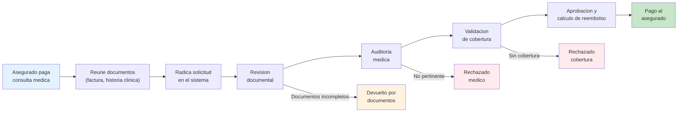
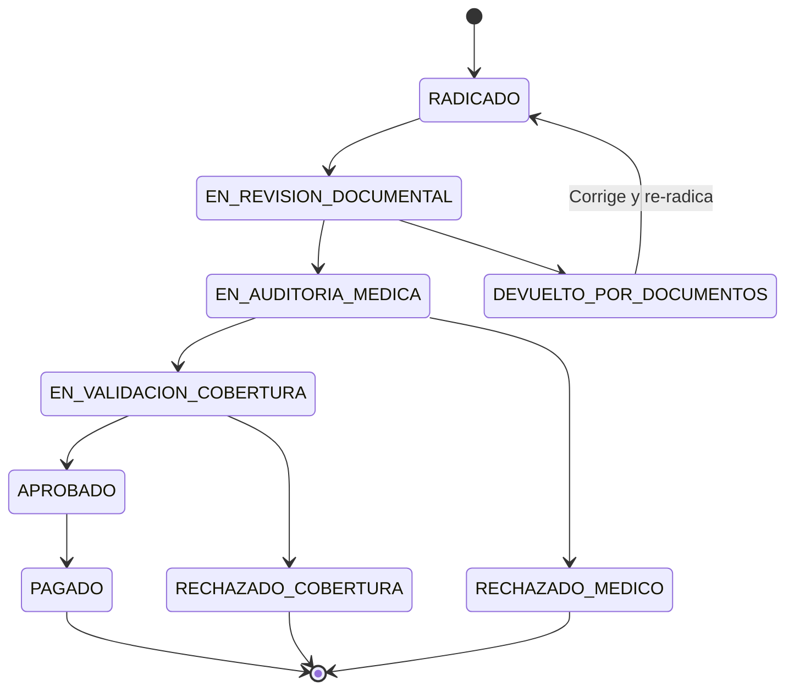
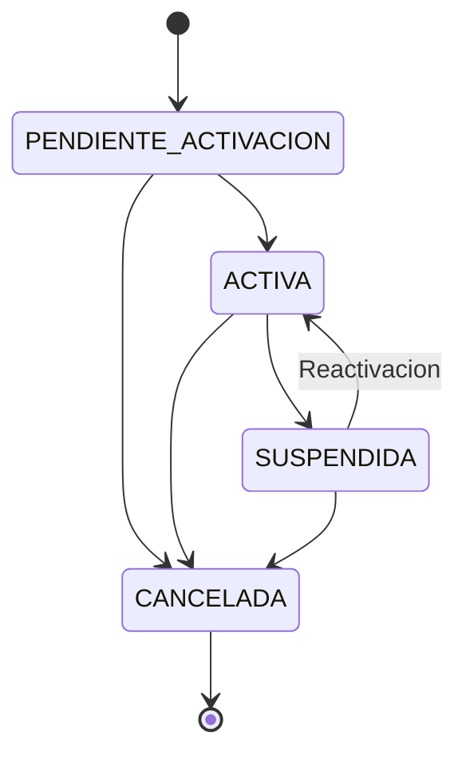
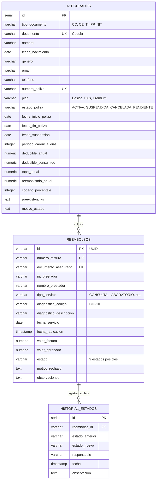

# Sistema de Reembolsos Medicos de Seguros

Sistema completo de reembolsos medicos de seguros de salud, construido como ejercicio de **vibe coding** en los dojos semanales de desarrolladores de [Tech&Solve](https://techandsolve.com).

Simula el proceso colombiano de reembolsos regulado por la Superintendencia Financiera (Decreto 2555/2010, Ley 1581/2012, Ley 1751/2015), con fuentes de HDI Seguros, SURA, Colmedica, Allianz y FASECOLDA.

> **Principio rector del dojo:** No complejizar. Empezar como un "hola mundo" y evolucionar paso a paso.

---

## Proceso de Negocio

El asegurado paga una consulta medica de su bolsillo, reune los documentos y solicita el reembolso a su aseguradora.



---

## Maquina de Estados — Reembolsos

Cada solicitud de reembolso sigue una maquina de estados estricta con transiciones validadas.



| Estado | Responsable | Descripcion |
|---|---|---|
| RADICADO | Sistema | Solicitud recibida |
| EN_REVISION_DOCUMENTAL | Gestor de reclamaciones | Verifica documentos completos |
| DEVUELTO_POR_DOCUMENTOS | Gestor | Faltan documentos o son ilegibles |
| EN_AUDITORIA_MEDICA | Medico auditor | Valida necesidad y pertinencia medica |
| RECHAZADO_MEDICO | Medico auditor | No es medicamente necesario |
| EN_VALIDACION_COBERTURA | Validador de cobertura | Verifica poliza, topes, exclusiones |
| RECHAZADO_COBERTURA | Validador | No cubierto o tope excedido |
| APROBADO | Sistema | Calcula valor a reembolsar |
| PAGADO | Sistema | Transferencia realizada |

---

## Maquina de Estados — Polizas

Las polizas de asegurados tienen su propio ciclo de vida con transiciones validadas.



| Transicion | Regla |
|---|---|
| Suspender | Requiere motivo obligatorio |
| Cancelar | Requiere motivo. No se puede cancelar si hay reembolsos en tramite |
| Reactivar (> 90 dias) | Resetea contadores de deducible y reembolsado anual |

---

## Arquitectura


---

## Modelo de Datos



---

## Calculo del Reembolso

Cuando un reembolso llega al estado **APROBADO**, el sistema calcula automaticamente:

```
1. Verificar tope anual: reembolsado_anual + valor_factura <= tope_anual
2. Deducible pendiente = deducible_anual - deducible_consumido
3. Valor despues de deducible = valor_factura - deducible_pendiente (minimo 0)
4. Valor aprobado = valor_despues_deducible * (1 - copago%)
```

**Ejemplo:** Factura de $2.000.000, deducible pendiente $320.000, copago 20%:
```
Despues de deducible: $2.000.000 - $320.000 = $1.680.000
Valor aprobado: $1.680.000 * 0.80 = $1.344.000
```

---

## Reglas de Negocio

### Reembolsos

| # | Regla | Momento |
|---|---|---|
| 1 | Poliza del asegurado debe estar ACTIVA | Al radicar |
| 2 | Factura no puede tener mas de 30 dias desde el servicio | Al radicar |
| 3 | Fecha del servicio no puede ser futura | Al radicar |
| 4 | Numero de factura no puede estar duplicado | Al radicar |
| 5 | NIT del prestador debe tener 9-10 digitos | Al radicar |
| 6 | Tipo de servicio debe ser valido | Al radicar |
| 7 | Valor de factura debe ser mayor a cero | Al radicar |
| 8 | Transiciones de estado solo las permitidas | Al cambiar estado |
| 9 | Rechazos requieren motivo obligatorio | Al rechazar |
| 10 | Tope anual no puede ser excedido | Al aprobar |
| 11 | Deducible y copago se aplican automaticamente | Al aprobar |
| 12 | Datos de la factura son inmutables despues de radicados | Siempre |
| 13 | Al escanear con IA, campos auto-llenados se deshabilitan | En el frontend |

### Asegurados (CRUD)

| # | Regla | Momento |
|---|---|---|
| 1 | Documento entre 6 y 12 caracteres, no duplicado | Al crear |
| 2 | Numero de poliza no duplicado | Al crear |
| 3 | Copago entre 0% y 30% | Al crear/editar |
| 4 | No se puede bajar deducible por debajo de lo consumido | Al editar |
| 5 | No se puede bajar tope por debajo de lo reembolsado | Al editar |
| 6 | Documento y tipo_documento no editables | Al editar |
| 7 | Suspender/cancelar requiere motivo | Al cambiar estado |
| 8 | No cancelar si hay reembolsos en tramite | Al cancelar |
| 9 | Reactivacion > 90 dias resetea contadores | Al reactivar |
| 10 | No eliminar asegurado con reembolsos asociados | Al eliminar |

---

## Endpoints API

### Asegurados

| Metodo | Ruta | Descripcion |
|---|---|---|
| `GET` | `/asegurados` | Lista todos los asegurados |
| `GET` | `/asegurados/{documento}` | Consulta un asegurado por cedula |
| `POST` | `/asegurados` | Crear asegurado |
| `PUT` | `/asegurados/{documento}` | Editar asegurado |
| `PATCH` | `/asegurados/{documento}/estado` | Cambiar estado de poliza |
| `DELETE` | `/asegurados/{documento}` | Eliminar asegurado |

### Reembolsos

| Metodo | Ruta | Descripcion |
|---|---|---|
| `POST` | `/facturas/escanear` | Extrae datos de imagen con Claude Vision |
| `POST` | `/reembolsos` | Radica solicitud de reembolso |
| `GET` | `/reembolsos` | Lista reembolsos (filtro opcional `?estado=`) |
| `GET` | `/reembolsos/{numero_factura}` | Consulta reembolso por numero de factura |
| `PATCH` | `/reembolsos/{id}/estado` | Cambia estado de un reembolso |
| `GET` | `/reembolsos/{id}/historial` | Historial de estados de un reembolso |

### Admin

| Metodo | Ruta | Descripcion |
|---|---|---|
| `GET` | `/` | Sirve el frontend |
| `DELETE` | `/datos` | Reinicia reembolsos (conserva asegurados) |

Swagger UI disponible en `/docs`.

---

## Estructura del Proyecto

```
dojo-facturas/
├── .env                     # ANTHROPIC_API_KEY (no subir al repo)
├── database.py              # Conexion PostgreSQL + init_db + migraciones + seed
├── main.py                  # App FastAPI — 15 endpoints
├── models.py                # Modelos Pydantic con validadores (6 modelos)
├── services.py              # Logica de negocio + reglas + Claude Vision
├── requirements.txt         # Dependencias Python
├── generar_facturas.py      # Genera 3 facturas de ejemplo como PNG
├── facturas_ejemplo/        # Imagenes PNG de facturas para probar escaneo
│   ├── factura_1_consulta.png
│   ├── factura_2_laboratorio.png
│   └── factura_3_cirugia.png
└── static/
    └── index.html           # Frontend con sidebar lateral (4 secciones)

context/
├── Dojo.txt                 # Transcripcion original de la planeacion
└── historial-desarrollo.md  # 18 pasos progresivos del desarrollo

CLAUDE.md                    # Contexto para Claude Code
README.md                    # Este archivo
```

---

## Datos de Prueba

El sistema crea automaticamente 3 asegurados al iniciar:

| Nombre | Documento | Tipo | Plan | Poliza | Deducible | Tope Anual | Copago | Email |
|---|---|---|---|---|---|---|---|---|
| Maria Lopez | 1017234567 | CC | Premium | ACTIVA | $500.000 | $50.000.000 | 20% | maria.lopez@email.com |
| Carlos Ruiz | 1098765432 | CC | Basico | ACTIVA | $1.000.000 | $20.000.000 | 30% | carlos.ruiz@email.com |
| Ana Garcia | 1045678901 | CC | Plus | SUSPENDIDA | $750.000 | $35.000.000 | 25% | ana.garcia@email.com |

Ana Garcia tiene poliza SUSPENDIDA (mora > 30 dias) para probar el rechazo al radicar.

### Facturas de Ejemplo

3 facturas PNG generadas con `python generar_facturas.py` para probar el escaneo con IA:

| Factura | Prestador | Servicio | Valor |
|---|---|---|---|
| FAC-2024-001 | Clinica del Norte (NIT 900.111.222-3) | Consulta | $180.000 |
| FAC-2024-047 | Laboratorio Nacional (NIT 900.333.444-7) | Laboratorio | $450.000 |
| FAC-2024-103 | Dr. Perez Especialistas (NIT 900.555.666-1) | Cirugia | $8.500.000 |

---

## Requisitos

- Python 3.10+
- PostgreSQL 16
- Pillow (para generar facturas de ejemplo)
- API key de Anthropic (para escaneo de facturas con IA)

## Instalacion y Ejecucion

```bash
# 1. Clonar el repositorio
git clone https://github.com/gabocolo/dojo-reembolsos.git
cd dojo-reembolsos

# 2. Instalar dependencias
pip install -r dojo-facturas/requirements.txt
pip install Pillow  # para generar facturas de ejemplo

# 3. Crear la base de datos en PostgreSQL
createdb dojo_facturas_db

# 4. Configurar variables de entorno
cp dojo-facturas/.env.example dojo-facturas/.env
# Editar .env con tu ANTHROPIC_API_KEY y credenciales de PostgreSQL

# 5. Generar facturas de ejemplo (opcional)
cd dojo-facturas && python generar_facturas.py

# 6. Levantar el servidor
python -m uvicorn main:app --reload --port 8001

# 7. Abrir en el navegador
# http://localhost:8001
```

Las tablas y datos de prueba se crean automaticamente al iniciar el servidor.

### Variables de Entorno

| Variable | Default | Descripcion |
|---|---|---|
| `ANTHROPIC_API_KEY` | — | API key de Anthropic (requerida para escaneo) |
| `PG_HOST` | `localhost` | Host de PostgreSQL |
| `PG_PORT` | `5432` | Puerto de PostgreSQL |
| `PG_DATABASE` | `dojo_facturas_db` | Nombre de la base de datos |
| `PG_USER` | `app_admin` | Usuario de PostgreSQL |
| `PG_PASSWORD` | `dev_password_change_me` | Password de PostgreSQL |

---

## Contexto: Dojo de Vibe Coding

Este proyecto se construyo en vivo durante los dojos semanales de **Tech&Solve**, donde lideres tecnicos de desarrollo aprenden a construir software con IA (vibe coding).

**Formato:** Viernes 4:00 PM - 5:30 PM | Solo desarrolladores y lideres tecnicos

El sistema evoluciono progresivamente en 18 pasos documentados en [`context/historial-desarrollo.md`](context/historial-desarrollo.md) — desde un "hola mundo" con FastAPI hasta un sistema completo de reembolsos medicos con:
- Maquina de estados para reembolsos (9 estados) y polizas (4 estados)
- CRUD completo de asegurados con normativa colombiana
- Escaneo de facturas con Claude Vision API
- Navegacion por sidebar lateral
- Base de datos PostgreSQL con migraciones

### Stack Tecnologico

| Tecnologia | Uso |
|---|---|
| Python + FastAPI | Backend API (15 endpoints) |
| Pydantic | Validacion de datos (6 modelos) |
| PostgreSQL 16 + psycopg2 | Persistencia (3 tablas) |
| Claude Vision API | Escaneo de facturas por imagen |
| Pillow | Generacion de facturas de ejemplo |
| HTML + CSS + JS vanilla | Frontend (single page con sidebar) |
| GitHub CLI | Gestion del repositorio |

---

*Construido con vibe coding usando [Claude Code](https://claude.ai/code)*
